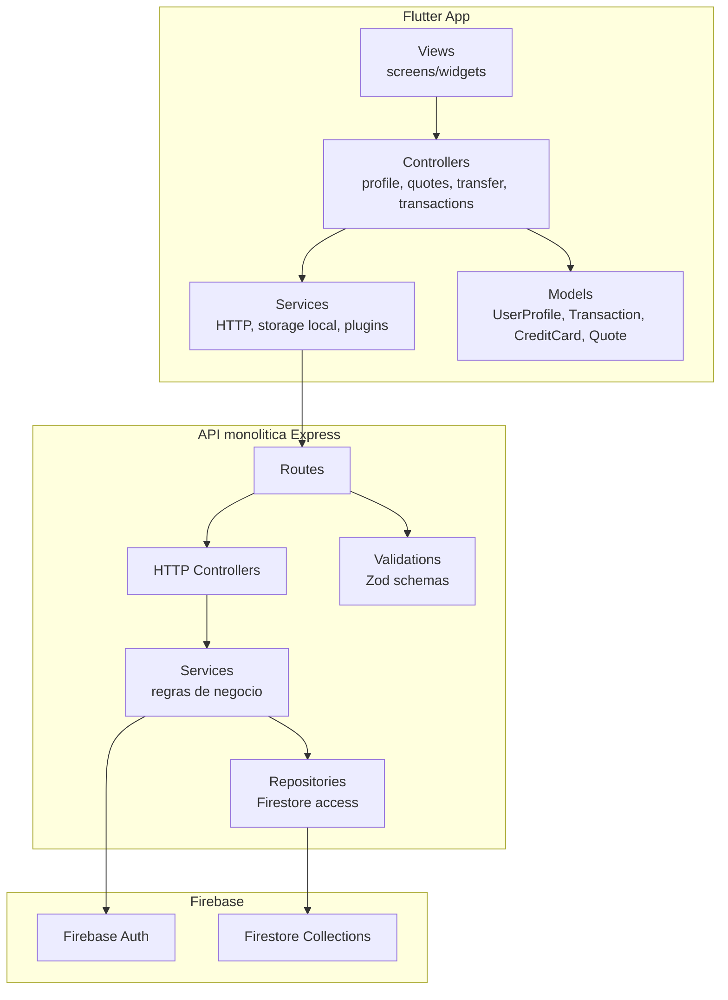
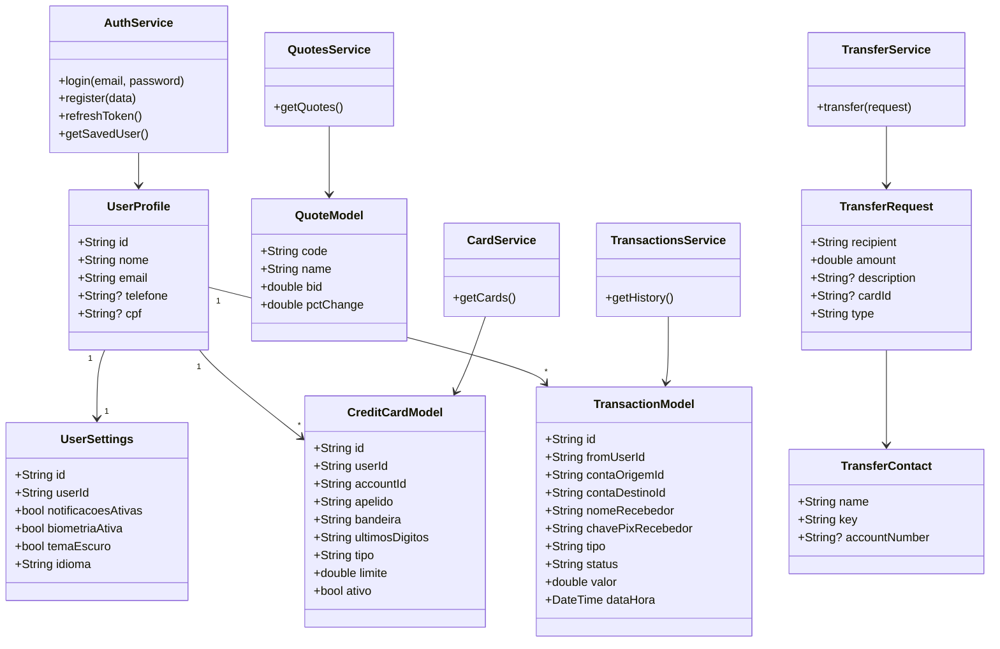
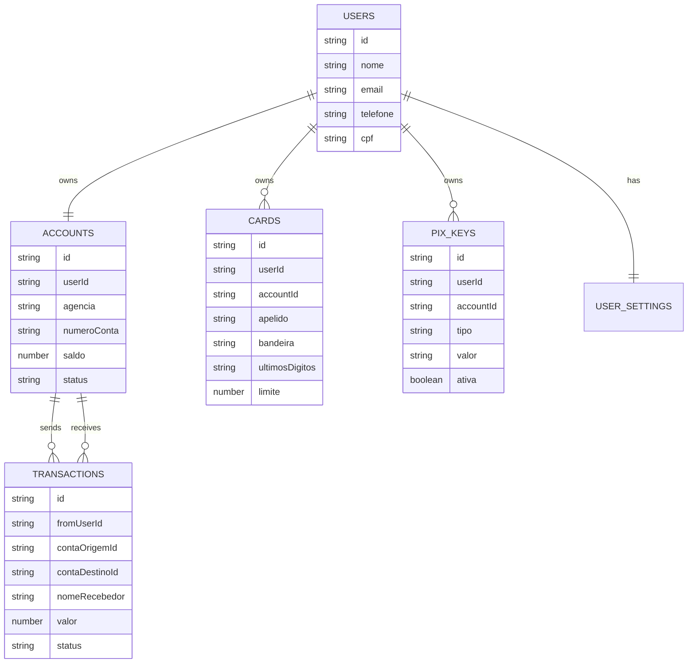
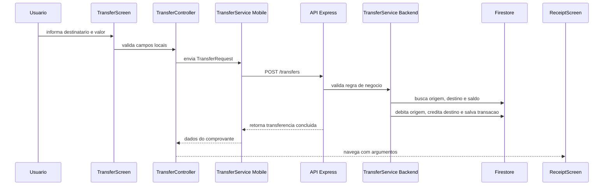

# Arquitetura do Quantum Bank

O projeto usa uma arquitetura monolitica no backend e uma separacao em camadas
no app Flutter. A divisao geral segue uma ideia de MVC adaptada:

- Model: modelos de dados no Flutter e documentos do Firestore.
- View: telas e widgets Flutter.
- Controller: controllers Flutter e controllers HTTP do Express.
- Service: regras de negocio e integracao com APIs.
- Repository: acesso direto ao Firestore no backend.

> Status: incompleto. A arquitetura ja suporta o fluxo principal de login,
> home, transferencia e comprovante, mas ainda faltam testes, hospedagem da API
> e finalizacao de recursos secundarios.

## MVC monolitico

## Diagrama de classes

## Collections do Firestore

## Fluxo de transferencia

## Observacoes tecnicas

- O backend e monolitico porque rotas, controllers, services e repositories
  ficam em uma unica aplicacao Express.
- O app Flutter nao acessa o Firestore diretamente; ele conversa com a API.
- O token do Firebase Auth e enviado no header `Authorization`.
- O comprovante usa plugin para capturar a tela e compartilhar o arquivo.
