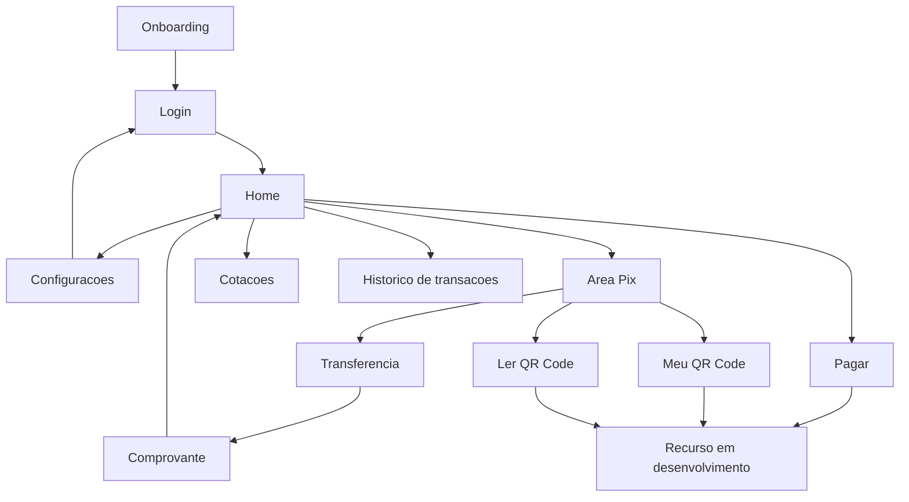
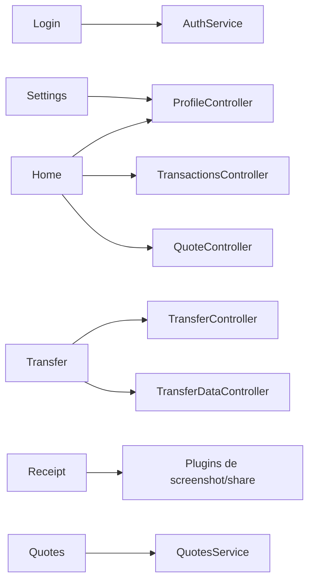

# Telas do Quantum Bank

Este documento substitui os resumos antigos de telas. Ele descreve o fluxo
atual do app Flutter e tambem indica quais areas ainda estao incompletas.

> Status: incompleto. Algumas telas ja estao integradas ao backend, enquanto
> outras ainda funcionam como visual ou levam para "recurso em desenvolvimento".

## Fluxo principal

## Telas implementadas

| Tela | Arquivo | Estado | Observacao |
| --- | --- | --- | --- |
| Onboarding | `mobile/lib/screens/oneboarding/oneboarding_screen.dart` | Parcial | Entrada visual do app. |
| Login | `mobile/lib/screens/auth/login_screen.dart` | Funcional | Login via backend e usuario salvo localmente. |
| Home | `mobile/lib/screens/home/home_screen.dart` | Funcional parcial | Dados reais do usuario, saldo, cotacoes e 2 transacoes recentes. |
| Area Pix | `mobile/lib/screens/pix/pix_area_screen.dart` | Visual funcional | Atalhos e navegacao principal de Pix. |
| Transferencia | `mobile/lib/screens/transfer/transfer_screen.dart` | Funcional | Valida saldo, destinatario e cartao do usuario. |
| Comprovante | `mobile/lib/screens/receipt/receipt_screen.dart` | Funcional | Mostra dados da transferencia e compartilha print. |
| Cotacoes | `mobile/lib/screens/quotes/quotes_screen.dart` | Funcional parcial | Busca moedas e permite ver mais/menos itens. |
| Configuracoes | `mobile/lib/screens/settings/settings_screen.dart` | Parcial | Integracao com dados do usuario e opcoes visuais. |
| Perfil | `mobile/lib/screens/profile/profile_screen.dart` | Parcial | Dados do usuario e navegacao. |
| Historico | `mobile/lib/screens/transactions/transactions_history_screen.dart` | Parcial | Lista transacoes do backend. |
| Pagar | `mobile/lib/screens/pay/pay_screen.dart` | Incompleto | Mantido como tela visual/recurso futuro. |
| Recurso em desenvolvimento | `mobile/lib/screens/under_development_screen.dart` | Funcional | Usada para rotas ainda nao concluidas. |

## Mapa de responsabilidades por tela

## Recursos incompletos por area

- Pix: leitura real de QR Code e geracao real do QR ainda precisam de plugin e
  regra final.
- Pagamentos: ainda nao ha fluxo completo de boleto/conta.
- Perfil/configuracoes: falta persistir todas as opcoes do usuario.
- Autenticacao: recuperacao de senha ainda precisa ser finalizada.
- Android: falta teste final com API hospedada e APK release.

## Design

O design das telas foi feito no Figma. A implementacao seguiu as referencias
visuais enviadas durante o desenvolvimento: tela escura, cards roxos, botoes
amarelo-lima, icones SVG e layout mobile no estilo de banco digital.
